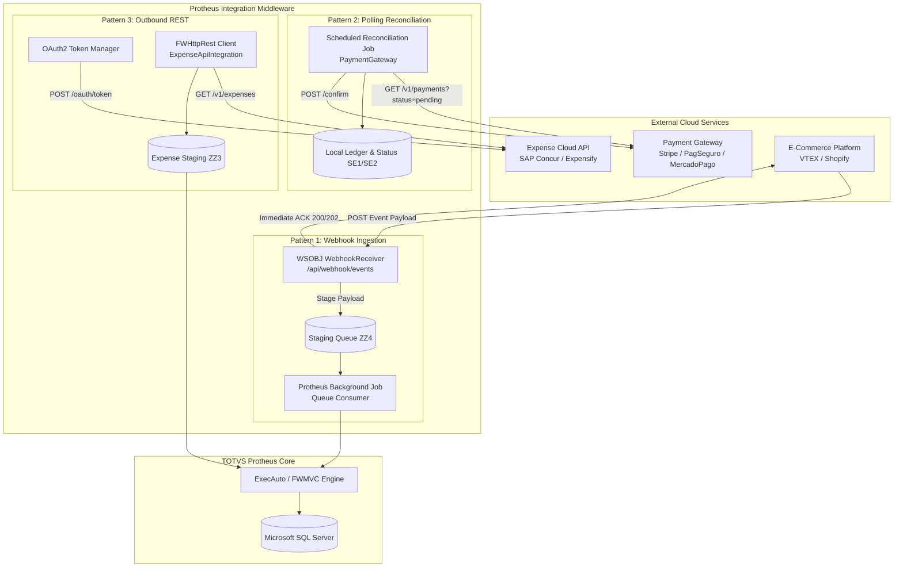
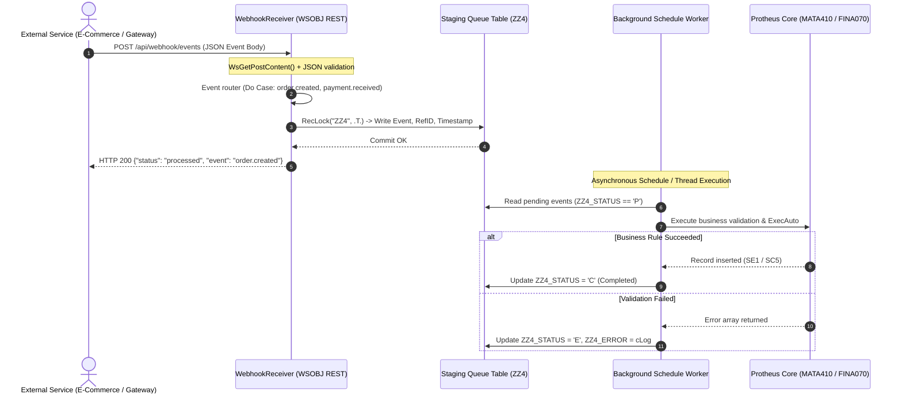
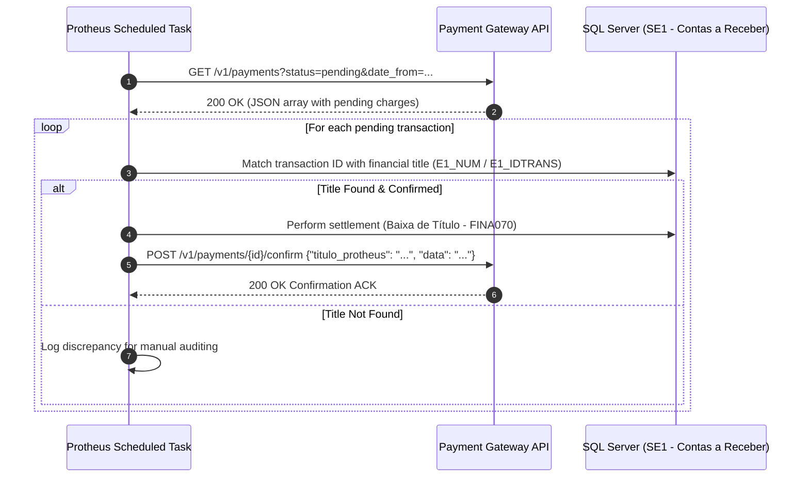

# Protheus Integration Lab

[](https://tdn.totvs.com/)
[](https://www.totvs.com/protheus/)
[](#integration-patterns)
[](#security--architectural-standards)
[](https://opensource.org/licenses/MIT)

An enterprise architectural reference and code laboratory showcasing **integration patterns** between **TOTVS Protheus ERP** and external modern cloud services.

Includes complete, battle-tested ADVPL implementations for **Event-Driven Webhook Ingestion**, **Payment Gateway Reconciliation**, and **OAuth2-authenticated REST API consumption**.

---

> [!NOTE]
> **Educational & Security Disclaimer**:  
> All routines, schemas, endpoints, table names (`ZZ3`, `ZZ4`), and sample payloads in this repository are strictly educational and generic. No proprietary customer names, confidential ERP business rules, production IP addresses, or corporate credentials are used.

---

## Integration Patterns



---

## Pattern 1: Event-Driven Webhook Ingestion & Decoupled Queue

When external platforms notify Protheus of business events (e.g. order placed, payment settled, customer registered), synchronous execution inside the HTTP request thread creates thread pool exhaustion and timeout risks.

This pattern demonstrates **asynchronous staging**: the incoming webhook is validated, written immediately to a persistent queue table (`ZZ4`), and acknowledged with HTTP `200 OK` in milliseconds. A background worker job processes the queue asynchronously.

### Webhook Processing Lifecycle



#### Supported Event Types (`webhook-receiver.prw`)
- `order.created` — Stage e-commerce purchase order for sales order generation.
- `order.updated` — Track logistical or fulfillment status modifications.
- `payment.received` — Automatic receivable settlement (`Contas a Receber`).
- `customer.created` — Customer synchronization into the entity master (`SA1`).

---

## Pattern 2: Polling Reconciliation (Payment Gateway)

In financial integrations where webhooks are either unavailable or require dual-ledger verification, the system runs scheduled batch jobs using `FWHttpRest` to poll the external gateway for pending transactions and synchronize statuses.

### Reconciliation Workflow (`payment-gateway.prw`)



---

## Pattern 3: OAuth2-Protected Outbound Consumption (`expense-api.prw`)

Enterprise systems frequently integrate with SaaS platforms (corporate travel, corporate cards, expense managers). This pattern implements:
1. **OAuth2 Client Credentials Grant**: Securely requests a Bearer token via `POST /oauth/token`.
2. **Authorized Data Retrieval**: Queries approved expense reports with `Authorization: Bearer <token>`.
3. **Staging Batch Ingestion**: Populates staging tables (`ZZ3`) prior to automated accounts payable (`SE2`) posting.

---

## Repository Map

```
protheus-integration-lab/
├── README.md
├── .gitattributes
└── examples/
    ├── payment-gateway/
    │   └── payment-gateway.prw     # Query pending gateway transactions, reconcile & callback
    ├── expense-api/
    │   └── expense-api.prw         # OAuth2 Client Credentials flow, JSON parsing & ZZ3 staging
    └── webhook/
        └── webhook-receiver.prw    # WSOBJ endpoint, JSON routing, event logging & queue dispatch
```

---

## Example JSON Payloads

### Webhook Event Payload (`POST /api/webhook/events`)

```json
{
  "event": "payment.received",
  "resource": "payment",
  "id": "PAY-89234710",
  "amount": 1450.75,
  "timestamp": "2026-09-16T15:30:00Z",
  "customer": {
    "name": "Acme Distribuidora Ltda",
    "document": "12345678000199"
  }
}
```

### Webhook Response Payload (`200 OK`)

```json
{
  "status": "processed",
  "event": "payment.received"
}
```

### Expense API Payload (`GET /v1/expenses?status=approved`)

```json
{
  "total": 1,
  "data": [
    {
      "id": "EXP-2026-0891",
      "employee_id": "000142",
      "description": "Viagem Técnica - Instalação de Equipamentos",
      "amount": 620.50,
      "date": "20260912",
      "category": "HOSPEDAGEM"
    }
  ]
}
```

---

## Security & Architectural Standards

1. **Idempotency**: All webhook events must be checked against duplicate event IDs (`ZZ4_REFID`) before processing.
2. **Credential Safety**: Never hardcode production API secrets or bearer tokens in `.prw` source files. Store sensitive parameters in encrypted Protheus parameter tables (`SX6`) or environment secret managers.
3. **Transactional Integrity**: Use `Begin Transaction` and `DisarmTransaction()` blocks when moving staged records into official ERP tables (`SC5`, `SE1`, `SE2`, `SA1`).
4. **Network Resilience**: Configure explicit timeouts (`oHttp:nTimeOut := 30`) on outbound calls to avoid holding AppServer worker threads indefinitely.

---

## License

This project is licensed under the [MIT License](LICENSE).
