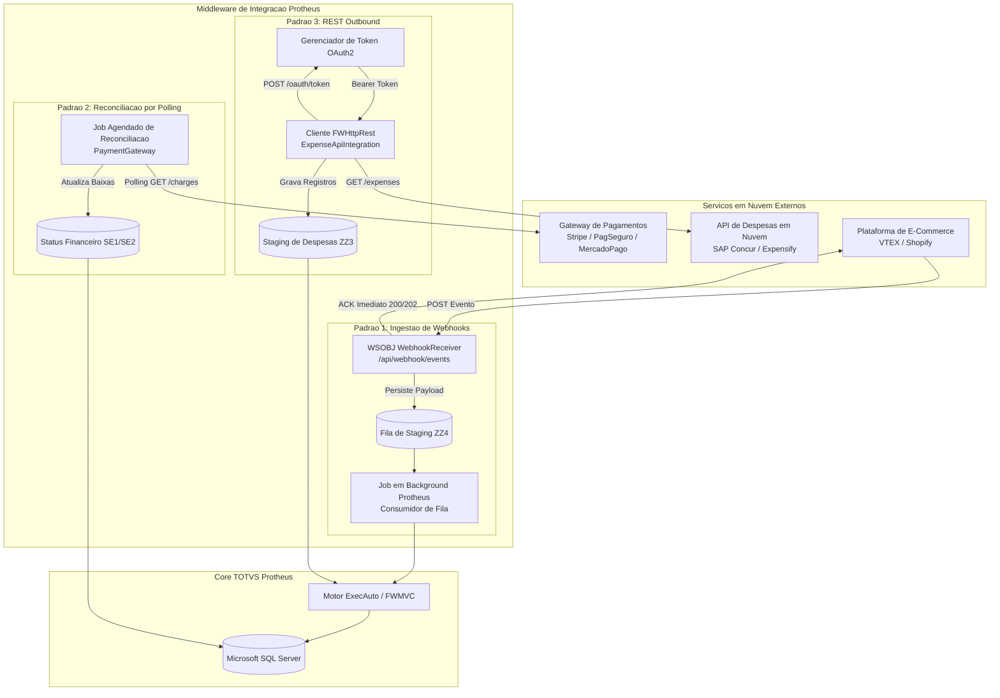

# Laboratório de Integração Protheus

 

[English](README.md) &nbsp;|&nbsp; **Português (Brasil)**

 

Referência arquitetural e laboratório de código demonstrando **padrões corporativos de integração** entre o **TOTVS Protheus ERP** e serviços modernos em nuvem.

Contempla implementações canônicas em ADVPL para **Ingestão de Webhooks orientada a eventos**, **Reconciliação de Gateway de Pagamentos** e **Consumo de APIs REST com autenticação OAuth2**.

---

> [!NOTE]
> **Aviso Educacional & de Segurança**:  
> Todas as rotinas, esquemas, endpoints, tabelas customizadas (`ZZ3`, `ZZ4`) e cargas de dados de exemplo neste repositório são estritamente educacionais e genéricas. Não há nomes de clientes reais, regras de negócio confidenciais, IPs de produção ou credenciais corporativas.

---

## Padrões de Integração

---

## Padrões de Segurança e Arquitetura

1. **Idempotência**: Todos os eventos recebidos via webhook são confrontados contra IDs de eventos já processados (`ZZ4_REFID`) para prevenir duplicidade de lançamentos.
2. **Segurança de Credenciais**: Credenciais de API ou tokens de produção nunca devem ser gravados diretamente em fontes `.prw`. Devem ser gerenciados via tabelas cifradas (`SX6`) ou cofres de segredos.
3. **Integridade Transacional**: Uso mandatório de `Begin Transaction` e `DisarmTransaction()` na migração de dados de staging para tabelas oficiais (`SC5`, `SE1`, `SE2`, `SA1`).
4. **Resiliência de Rede**: Definição de timeouts explícitos (`oHttp:nTimeOut := 30`) em chamadas outbound para evitar retenção indefinida de threads no AppServer.

---

## Licença

Distribuído sob a licença [MIT](LICENSE).
